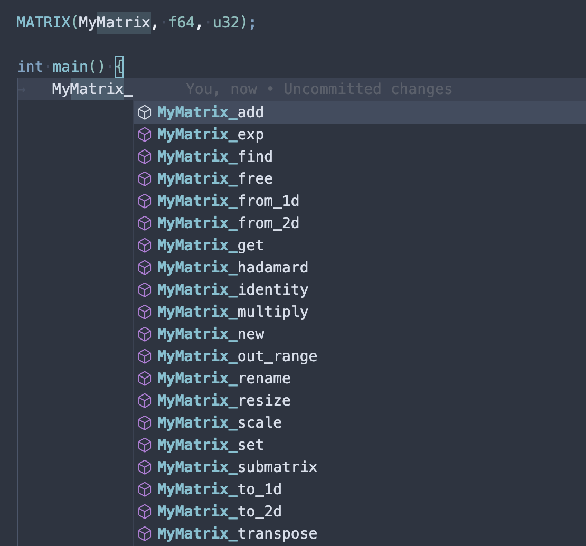

# libmatrix

A matrix library, in C.

It use sparse matrix representation under the hood.

## Features

### Matrix Declaration

Before you can do anything with a matrix, you need to declare it. This is done with the `MATRIX` macro.

```c
// definitions (with implementations), usually in a source file
MATRIX(MyMatrix, double, int64_t);

// sometimes, you may want to use the following macro instead of the above one
// declarations (without implementations), usually in a header file
DECLARE_MATRIX(MyMatrix, double, int64_t);
```

This declares a matrix type named `MyMatrix` with a `double` as the data type and an `int64_t` as the index type.

Then, you can use all the functions that are defined for `MyMatrix`:



* `MatrixType_new`
* `MatrixType_free`
* `MatrixType_from_1d`
* `MatrixType_from_2d`
* `MatrixType_to_1d`
* `MatrixType_to_2d`
* `MatrixType_identity`
* `MatrixType_get`
* `MatrixType_set`
* `MatrixType_find`
* `MatrixType_reshape`
* `MatrixType_rename`
* `MatrixType_scale`
* `MatrixType_transpose`
* `MatrixType_add`
* `MatrixType_multiply`
* `MatrixType_hadamard`
* `MatrixType_exp`
* `MatrixType_submatrix`
* ...

### Matrix Creation

You can simply create a matrix with `MatrixType_new`:

```c
MyMatrix* matrix = MyMatrix_new(3, 3);
```

This creates a 3x3 matrix.

> Tip: Use `MatrixType_identity` to create an identity matrix.

You can also create a matrix from a 1D array:

```c
double data[] = {1, 2, 3, 4, 5, 6, 7, 8, 9};
MyMatrix* matrix = MyMatrix_from_1d(data, 3, 3);
```

Or from a 2D array:

```c
double data[3][3] = {{1, 2, 3}, {4, 5, 6}, {7, 8, 9}};
MyMatrix* matrix = MyMatrix_from_2d(data, 3, 3);
```

> Tip: Use `MatrixType_to_1d` and `MatrixType_to_2d` to convert a matrix to a 1D or 2D array.

No matter how you create a matrix, the matrix will get a random name of 4 characters.

You can change the name of the matrix with `MatrixType_rename`:

```c
MyMatrix_rename(matrix, "My Matrix Alpha");
```

The name string will be copied, so you can free it after calling `MatrixType_rename`.

If a matrix is no longer needed, you can free it with `MatrixType_free`:

```c
MyMatrix_free(matrix);
```

This will free the matrix with all its elements and its name.

### Matrix Operations

You can set the value of a matrix at a specific index with `MatrixType_set`:

```c
MyMatrix_set(matrix, 0, 0, 1.0);
```

The above sets the value at the first row and first column to `1.0`.

You can also get the value of a matrix at a specific index with `MatrixType_get`:

```c
double value = MyMatrix_get(matrix, 0, 0);
```

Sometimes, you want to find the index of underlying data of a matrix. You can do this with `MatrixType_find`:

```c
MyMatrixFound found = MyMatrix_find(matrix, 1, 2);
if (found.exists) {
    // you can then access the underlying data with matrix->data[found.index]
}
```

This will find the index of the sparse matrix element at the first row and second column.

You can resize a matrix with `MatrixType_reshape`:

```c
MyMatrix_reshape(matrix, 4, 4);
```

By calling `MatrixType_reshape`, the matrix will be resized to a new size. If the new size is smaller than the old size, the matrix will be truncated. If the new size is larger than the old size, the only change will be the size of the matrix in the underlying data array.

### Matrix Arithmetic

All the below functions will return a new matrix. The original matrix will not be modified.

You can scale a matrix with `MatrixType_scale`:

```c
MyMatrix* scaled = MyMatrix_scale(matrix, 2.0);
```

This will return a new matrix with all the elements of the original matrix multiplied by `2.0`.

> Tip: Use `MatrixType_scale` to copy a matrix by passing `1.0` as the scale factor.

You can transpose a matrix with `MatrixType_transpose`:

```c
MyMatrix* transposed = MyMatrix_transpose(matrix);
```

This function uses fast transpose algorithm to transpose the matrix.

You can add two matrices with `MatrixType_add`:

```c
MyMatrix* added = MyMatrix_add(matrix1, matrix2);
```

This will return a new matrix with all the elements of the two matrices added together.

You can multiply two matrices with `MatrixType_multiply`:

```c
MyMatrix* multiplied = MyMatrix_multiply(matrix1, matrix2);
```

This will return a new matrix with all the elements of the two matrices multiplied together.

You can perform element-wise product of two matrices with `MatrixType_hadamard`:

```c
MyMatrix* hadamard = MyMatrix_hadamard(matrix1, matrix2);
```

This will return a new matrix with all the elements of the two matrices multiplied together.

> Notice: Before using addition, multiplication, or element-wise product, you need to make sure that the matrices are compatible and the dimensions are correct.

You can exponentiate a matrix with `MatrixType_exp`:

```c
MyMatrix* exponentiated = MyMatrix_exp(matrix, 2.0);
```

> Notice: The exponentiation function is only available for square matrices.

You can get a submatrix of a matrix with `MatrixType_submatrix`:

```c
MyMatrix* matrix = MyMatrix_from_1d(
    (double[]){
        1,  2,  3,  4, 
        5,  6,  7,  8, 
        9, 10, 11, 12
    }, 
    3, 
    4
);

MyMatrix* sub = MyMatrix_submatrix(matrix, (bool[]){1, 0, 1}, (bool[]){0, 1, 1, 0});
```

The second and third arguments are boolean arrays that indicate which rows and columns to include in the submatrix.

The above code will return a new matrix `sub` with the following elements:

```c
 2  3
10 11
```
