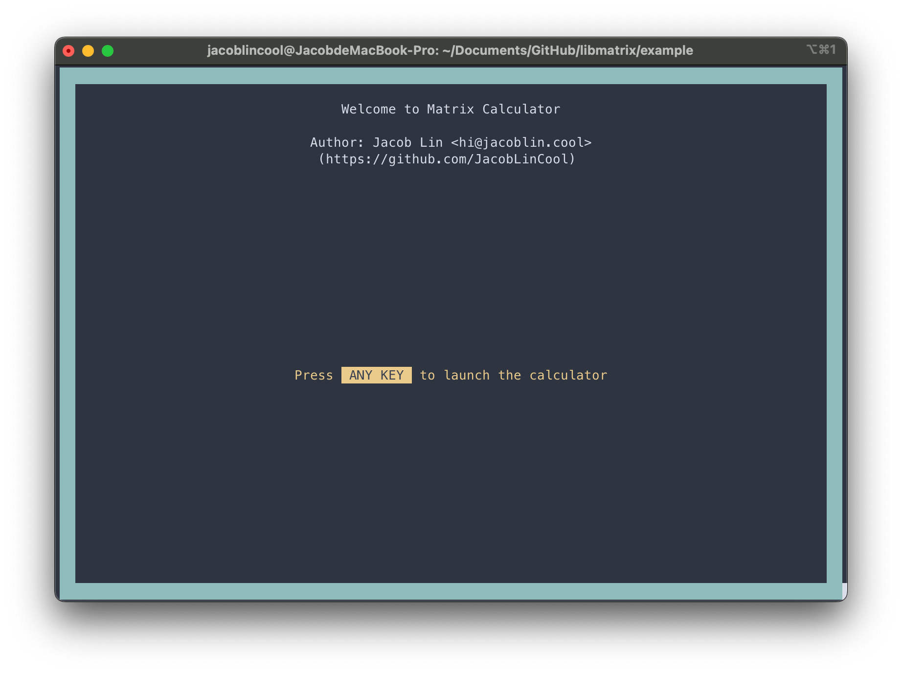

# Programming Homework 1

Matrix Calculator by Jacob Lin.

> Repository: <https://github.com/JacobLinCool/libmatrix>

## The `libmatrix` Library

It is definitely a well-designed matrix library. It is easy to use and well-documented. The code is also well-organized and easy to read. The code is also well-tested.

Some features:

-  Platform Independent
-  Generic by Nature
-  Memory Efficient (Sparse Matrix with Auto-Realloc)
-  Operations: Addition, Multiplication, Hadamard Multiplication, Transpose, Exponentiation, etc.
-  Elegantly Extract Submatrix
-  Transform to/from 1D/2D Array
-  Validation and Auto-fixing of a matrix

You can find the documentation [here](https://jacoblincool.github.io/libmatrix/). It's a doxygen-generated documentation.

## The Matrix Calculator

It is a simple matrix calculator built with my own matrix library `libmatrix`.

It supports macOS and Linux.

```c
#ifdef _WIN32
	fprintf(stderr, "This program is not supported on Windows. :(\n");
	return EXIT_FAILURE;
#endif
```

Some Highlights:

-  Responsive UI
-  Menu Navigation
-  Interactive Editor
-  Interactive Submatrix Extractor
-  Save/Load Matrix to/from File (`.matrices`, `.m`, `.txt`)

It has a good terminal UI. See the demo video for more details: <https://raw.githubusercontent.com/JacobLinCool/libmatrix/main/example/screenshots/screencast.mp4>

The user interface is responsive to the terminal size and self-explanatory.



You can make a new matrix and edit it in the editor. You can also load a matrix from a file (after you save it to a file).


> You can use `.` and `-` to change edit mode.
> In decimal mode, the reversed edit order is expected, which makes `0` in the middle possible.


> If you load matrices from `m`, it will find `m.matrices`, `m.m`, `m.txt`, `m` in that order.

You can then do some matrix operations.


After every operation, a new result matrix with random name will be created. You can rename it later.


You can also extract a submatrix from a matrix.


## Some Time Complexity Analysis

The following analysis is based on below declaration:

```c
DECLARE_MATRIX(MyMatrix, double, int64_t);
MATRIX(MyMatrix, double, int64_t);
```

`MyMatrix_new` is the constructor of `MyMatrix`. It takes `rows` and `cols` as parameters. It is $O(1)$ since it only allocates a little memory for the first term.

`MyMatrix_free` is the destructor of `MyMatrix`. It takes a pointer to `MyMatrix` as parameter. It is $O(1)$ since it only frees the memory allocated by `MyMatrix_new`.

`MyMatrix_rename` rename a matrix. It takes a pointer to `MyMatrix` and a new name as parameters. It is $O(1)$ since it only frees the old name and allocates a new name.

`MyMatrix_find` finds a term index in a matrix by row and column. It takes a pointer to `MyMatrix`, a row and a column as parameters. It is $O(log(n))$ since it uses binary search to find the term, `n` is the number of terms in the matrix. If it can find the term, it returns `{ true, index }`, otherwise it returns `{ false, index_to_insert }`.

`MyMatrix_set` sets a term in a matrix. It takes a pointer to `MyMatrix`, a row, a column and a value as parameters. It is $O(n)$ since it calls `MyMatrix_find` to find the term and try to keep the order of the terms.

`MyMatrix_get` gets a term in a matrix. It takes a pointer to `MyMatrix`, a row and a column as parameters. It is $O(log(n))$ since it calls `MyMatrix_find` to find the term.

`MyMatrix_transpose` transposes a matrix. It takes a pointer to `MyMatrix` as parameter. It is $O(cols + terms)$ since it pre-computes the number of terms in each column and then iterate through the terms to set the new terms.

`MyMatrix_add` adds two matrices. It takes two pointers to `MyMatrix` as parameters. It is $O(n + m)$, `n` and `m` are the number of terms in the two matrices. It iterates through all the terms in the two matrices. Although it calls `MyMatrix_set` to set the terms, it is $O(1)$ since it does not need to swap the terms because the terms are already sorted.

`MyMatrix_multiply` multiplies two matrices. It takes two pointers to `MyMatrix` as parameters. It is $O((A.terms \times B.cols) + (B.terms \times A.rows))$, $A$ and $B$ are the two matrices. It first transposes $B$, then iterates through all the terms in $A$ and $B_T$, and multiply with each other. Just like `MyMatrix_add`, `MyMatrix_set` at here is $O(1)$.

`MyMatrix_hadamard` multiplies two matrices element-wise. It takes two pointers to `MyMatrix` as parameters. It is $O(n + m)$, `n` and `m` are the number of terms in the two matrices. It iterates through all the terms in the two matrices just like `MyMatrix_add`.

`MyMatrix_exp` exponentiates a matrix. It takes a pointer to `MyMatrix` and an exponent (non-negative integer) as parameters. It is $O(log(exp) \times (terms \times cols))$, `terms` and `cols` are the number of terms and columns in the matrix. It uses binary exponentiation to compute the exponentiation so we get $O(log(exp))$.

`MyMatrix_submatrix` extracts a submatrix from a matrix. It takes a pointer to `MyMatrix`, a boolean array of rows and a boolean array of columns as parameters. It is $O(n)$, `n` is the number of terms in the matrix. It iterates through all the terms in the matrix and check if the corresponding row and column is selected (`true`).

## Some Fun Facts

```sh
❯ wc **/*.{h,c}
      17      50     358 libmatrix/src/common/basic.h
      17      52     365 libmatrix/src/common/huge.h
      17      50     358 libmatrix/src/common/int.h
      17      52     368 libmatrix/src/common/large.h
      17      51     365 libmatrix/src/common/long.h
      17      51     368 libmatrix/src/common/short.h
      17      51     373 libmatrix/src/common/shortest.h
      17      50     358 libmatrix/src/common/small.h
      17      50     351 libmatrix/src/common/tiny.h
      34     111    1199 libmatrix/src/guard.h
     584    2556   52189 libmatrix/src/matrix.h
      37     100     704 libmatrix/src/oxidation.h
      14      37     263 libmatrix/src/utils.h
      14      43     337 libmatrix/src/version.h
       8      19     502 src/component.h
      87     299    2961 src/components/menu.h
     108     394    2765 src/components/submatrix.h
      40     115    1118 src/components/welcome.h
       9      17     180 src/format.h
      25      56     436 src/key.h
      22      41     419 src/matrices.h
       5       7      94 src/matrix.h
      44      69     662 src/operations.h
      73     236    1643 src/tui.h
      75     203    1694 src/ui.h
       1       2      20 libmatrix/src/matrix.c
     205     694    6026 libmatrix/src/matrix.test.c
       6      36     238 libmatrix/src/oxidation.c
      10      38     214 libmatrix/src/utils.c
      15      25     219 libmatrix/src/utils.test.c
      79     323    2129 src/format.c
      63     199    1363 src/key.c
     124     254    2342 src/main.c
      61     162    1317 src/matrices.c
       3       5      55 src/matrix.c
     575    1781   13759 src/operations.c
     228     801    5491 src/tui.c
     320     998    8845 src/ui.c
    3022   10078  112448 total
```

There are more than 10,000 lines of code in this project, if you count the empty lines. (3,000 lines of code if you don't count the empty lines.)
